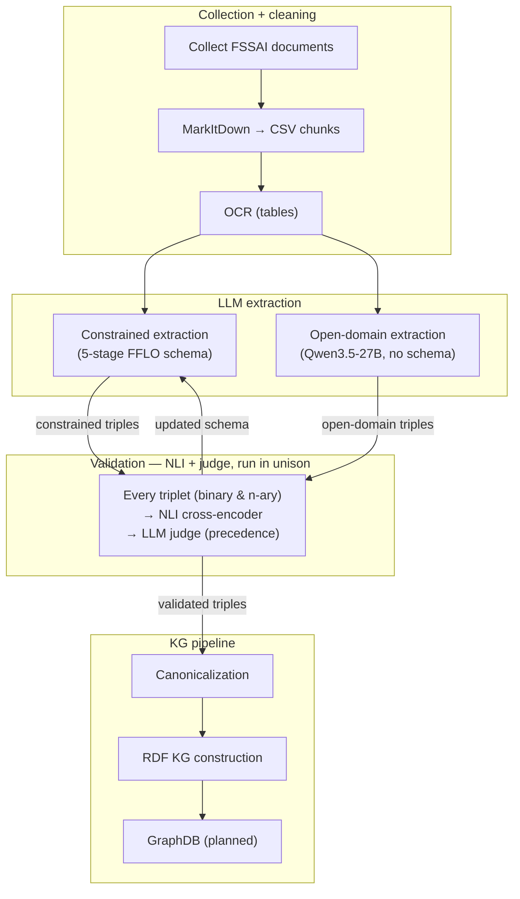

# Food Safety Knowledge Graph

An end-to-end pipeline that builds an **FFLO-based (Food Fraud Lifecycle
Ontology) RDF/OWL knowledge graph** from food-safety regulation text. The
primary corpus is FSSAI (Food Safety and Standards Authority of India)
regulations; the pipeline is dataset-agnostic and generalises to any food item
(e.g. milk adulteration, spice contamination).

The pipeline extracts structured `<subject, predicate, object>` triplets from
regulatory text with a schema-guided LLM, verifies every triplet against its
source text using an LLM-as-judge and a fine-tuned NLI cross-encoder,
canonicalises the resulting entities, and serialises a reified knowledge graph
with full provenance in Turtle/N-Triples.

> Detailed method docs, CLI references, and results tables live in
> [`src/documentation/extraction.md`](src/documentation/extraction.md) and
> [`src/documentation/validation.md`](src/documentation/validation.md).

## Pipeline



Stage → implementation:

- **S1** — `src/preprocessing_cleaning/build_corpus.py`
- **S2** — `src/extraction/extract_triplets.py` (constrained) + `src/extraction/unconstrained_pipeline.py` (open-domain)
- **S3** — `src/validation/` (NLI cross-encoder + LLM judge)
- **S4** — `src/extraction/canonicalise_kg.py` + `src/kg/build_rdf_kg.py`

## Ontology & schema

Triplets are typed against the **FFLO v7** ontology — 92 entity types and 67
relations across five lifecycle stages:

| Stage | Scope | Example relations |
|---|---|---|
| ACT | Adulterants, additives, fraud methods | `hasAdulterant`, `hasFunction`, `hasFraudType` |
| SPREAD | Supply-chain propagation | `propagatesTo`, `occursAt`, `carriedBy` |
| DETECTION | Sampling, analysis, findings | `identifies`, `foundIn`, `detectedBy` |
| REGULATION | Standards, limits, actions | `hasValue`, `appliesTo`, `compliesWith` |
| HEALTH | Health effects & populations | `causesEffect`, `affectsPopulation` |

The schema is defined in three places, kept in sync by the
`schema_validator` module:

1. [`src/schema_iterations/schema_v3.md`](src/schema_iterations/schema_v3.md) — canonical human-readable spec.
2. [`src/extraction/schema_config.json`](src/extraction/schema_config.json) — runtime source of truth (entity types, relations, domain/range, subclass hierarchy).
3. [`prompts/triplet_extraction_v2.txt`](prompts/triplet_extraction_v2.txt) — the system prompt the LLM sees.

Namespaces used throughout: `fflo`, `fkg`, `fso`, `ssn`, `sosa`, `prov`,
`lkif`, plus standard `rdf`/`rdfs`/`owl`/`xsd`.

## Repository layout

```
.
├── src/
│   ├── preprocessing_cleaning/   # PDF→markdown, URL scraping, cleaning, chunking
│   ├── extraction/               # triplet extraction, schema validation, canonicalisation
│   ├── validation/               # LLM-as-judge, NLI model, unconstrained validation
│   ├── kg/                       # RDF/OWL KG builder + unit tests
│   ├── schema_iterations/        # canonical ontology specs (v2, v3)
│   ├── documentation/            # detailed pipeline docs (extraction.md, validation.md)
│   ├── outputs/                  # triplets + KG output (kg.ttl, ontology.ttl, …)
│   └── requirements.txt
├── prompts/                      # extraction + unconstrained system prompts
├── model_checkpoints/            # fine-tuned NLI cross-encoder (deberta-v3-small)
└── README.md
```

## Setup

```bash
# Python 3.11 recommended
python3.11 -m venv food_lab
source food_lab/bin/activate

pip install -r src/requirements.txt
```

Extraction and judging run against **Qwen3.5-27B-FP8** served locally via vLLM
(OpenAI-compatible API):

```text
base URL: http://localhost:8030/v1
model:    Qwen/Qwen3.5-27B-FP8
```

Optional runtime deps (all pulled in by `requirements.txt`):

- **NLI validation**: `sentence-transformers` (+ `torch`, `transformers`) — the
  fine-tuned cross-encoder at `model_checkpoints/run4_deberta_v3_small`
  (84.4% accuracy on the FFLO validation set).
- **KG serialisation**: `rdflib`.
- **Web scraping**: `selenium` + a Chrome driver.

Input data (`src/data/` — FSSAI PDFs and processed chunks) is **not** checked
into the repo; the pipeline expects you to supply it.

## End-to-end quickstart

```bash
# 1. Build the chunk corpus from PDFs (and optionally URLs)
food_lab/bin/python src/preprocessing_cleaning/build_corpus.py \
    --pdf-dir   src/data/FSSAI_docs/pdfs \
    --output-dir src/data/FSSAI_docs/processed

# 2. Extract schema-guided triplets (Qwen via local vLLM)
food_lab/bin/python src/extraction/extract_triplets.py \
    --chunks-csv  src/data/FSSAI_docs/processed/chunks.csv \
    --prompt-file prompts/triplet_extraction_v2.txt \
    --schema-file src/extraction/schema_config.json \
    --output-dir  src/outputs/triplets \
    --base-url    http://localhost:8030/v1 \
    --model       Qwen/Qwen3.5-27B-FP8 \
    --resume

# 3. Validate triplets for entailment (LLM-as-judge, Qwen)
food_lab/bin/python src/validation/LLM_judge/judge.py \
    --chunks-csv    src/data/FSSAI_docs/processed/chunks.csv \
    --triplets-dir  src/outputs/triplets \
    --output-dir    src/outputs/validation \
    --schema-file   prompts/triplet_extraction_v2.txt \
    --judge-model   Qwen/Qwen3.5-27B-FP8 \
    --base-url      http://localhost:8030/v1 \
    --use-logprobs

# 4. Canonicalise entities and deduplicate triples
food_lab/bin/python src/extraction/canonicalise_kg.py \
    --input      src/outputs/triplets/triplets.csv \
    --output-dir src/outputs/triplets/

# 5. Build the RDF/OWL knowledge graph
food_lab/bin/python src/kg/build_rdf_kg.py \
    --triplets-csv  src/outputs/triplets/triplets_canonicalized.csv \
    --schema-config src/extraction/schema_config.json \
    --output-dir    src/outputs/kg_output
```

Full CLI references, output schemas, and retry workflows are documented in
[`src/documentation/extraction.md`](src/documentation/extraction.md) and
[`src/documentation/validation.md`](src/documentation/validation.md).

## Results (FSSAI corpus)

| Metric | Count |
|---|---|
| Chunks processed | 1,586 |
| Triplets extracted | 7,306 |
| Judgments produced | 4,267 |
| Entailed (schema-valid) | 1,354 (60%) |
| Proposed schema extensions | 565 |

## Testing

```bash
food_lab/bin/python -m unittest src/kg/test_build_rdf_kg.py
```
